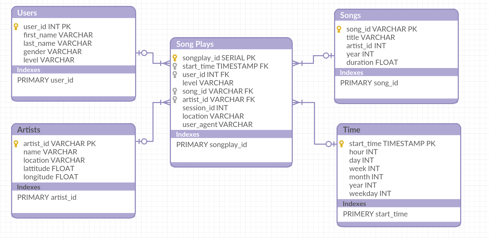
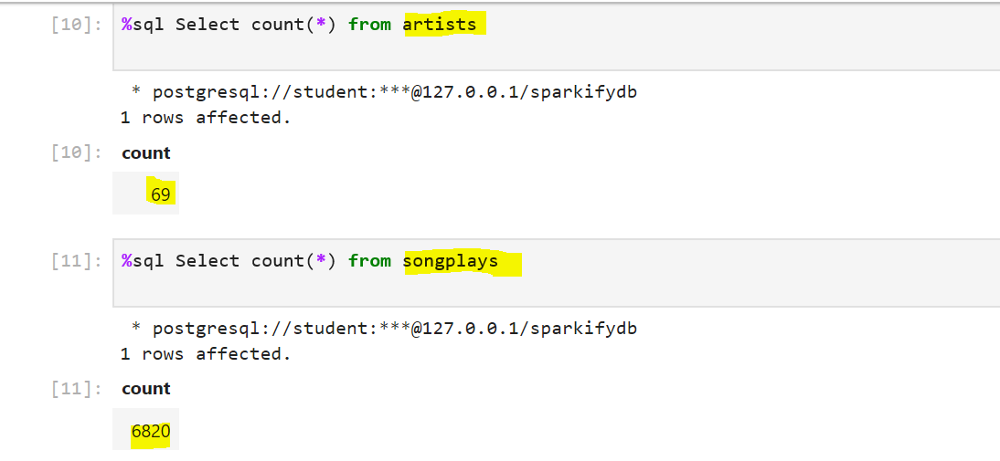
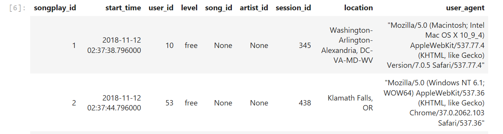

# Project: Data Modeling with Postgres
## Introduction
A startup called **Sparkify** wants to analyze the data they've been collecting on songs and user activity on their new music streaming app. The analytics team is particularly interested in understanding what songs users are listening to. They don't have an easy way to query their data, which resides in a directory of JSON logs on user activity on the app, as well as a directory with JSON metadata on the songs in their app.  
In this project, I created a Postgres database with tables designed to optimize queries on song play analysis.
## Schema for Song Play Analysis
As I followed the star schema structure, I created two types of tables (Fact Table & Dimension Tables). To fill these tables, I used the song and log datasets.  
#### 1. Fact Table  
   a. Name: ***songplays*** (records in log data associated with song plays)  
        - Columns: songplay_id, start_time, user_id, level, song_id, artist_id, session_id, location, user_agent  
#### 2. Dimension Tables:  
   a. Name: ***users*** (users in the app)  
       - Columns: user_id, first_name, last_name, gender, level  
   b. Name: ***songs*** (songs in music database)  
       - Columns: song_id, title, artist_id, year, duration  
   c. Name: ***artists*** (artists in music database)  
       - Columns: artist_id, name, location, latitude, longitude  
   d. Name: ***time*** (timestamps of records in songplays broken down into specific units)  
       - Columns: start_time, hour, day, week, month, year, weekday  

## Starting the program  
1. Execute "create_tables.py". This will create a fresh instance of the sparkifydb with empty tables.  
2. Execute "etl.py". This will load the data into the tables  
3. Open " test.ipynb". this will confirm that records were successfully inserted into each table.  

## Datasets  
#### 1. Song Dataset
- It is a subset of real data from the Million Song Dataset. Each file is in JSON format and contains metadata about a song and the artist of that song.  

#### 2. Log Dataset
- It is log files in JSON format generated by this event simulator based on the songs in the dataset above. These simulate activity logs from a music streaming app based on specified configurations.

## Example:  

